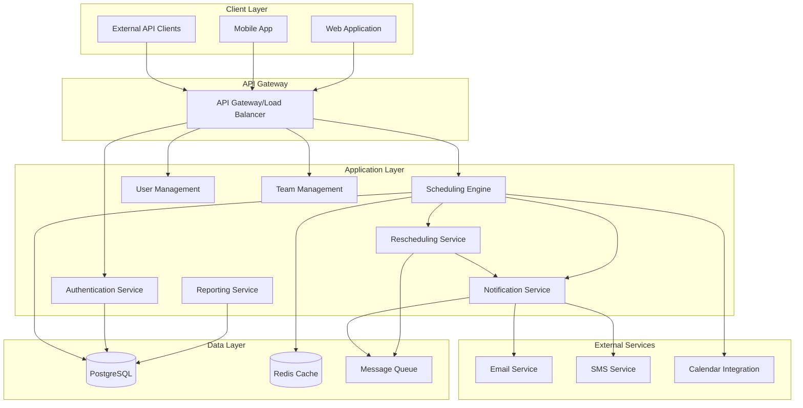
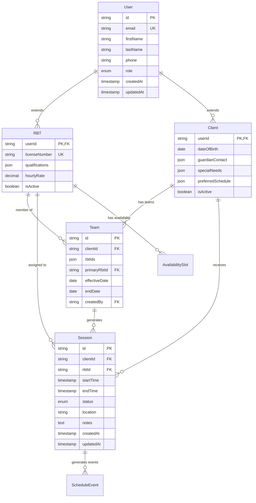

# Design Document - Automated ABA Scheduling System

## Overview

The Automated ABA Scheduling System is a constraint-based scheduling application that manages therapy sessions between Registered Behavioral Therapists (RBTs) and clients with autism spectrum disorders. The system employs intelligent algorithms to maintain therapeutic continuity while providing robust rescheduling capabilities for operational disruptions.

### Core Design Principles

- **Continuity-First**: Prioritize consistent RBT-client pairings to maintain therapeutic relationships
- **Constraint Satisfaction**: Use algorithmic approaches to handle complex scheduling requirements
- **Real-Time Responsiveness**: Provide immediate rescheduling when disruptions occur
- **Audit Compliance**: Maintain comprehensive logs for healthcare regulatory requirements
- **Scalable Architecture**: Support growth in clients, RBTs, and scheduling complexity

## Architecture

### System Architecture Overview



### Technology Stack

- **Backend**: Node.js with TypeScript
- **Database**: PostgreSQL for ACID compliance and complex queries
- **Cache**: Redis for session data and frequently accessed schedules
- **Message Queue**: Redis/Bull for async processing
- **API**: REST with GraphQL for complex queries
- **Real-time**: WebSocket for live schedule updates
- **Authentication**: JWT with role-based access control

## Components and Interfaces

### 1. Scheduling Engine

**Purpose**: Core constraint satisfaction and optimization for session scheduling

**Key Responsibilities**:
- Generate optimal schedules based on constraints and preferences
- Validate scheduling requests against business rules
- Maintain schedule integrity and prevent conflicts

**API Endpoints**:
```typescript
POST /api/schedule/generate
  - Input: { clientIds, dateRange, preferences }
  - Output: { schedule, conflicts, recommendations }

POST /api/schedule/session
  - Input: { clientId, rbtId, dateTime, duration }
  - Output: { sessionId, status, conflicts }

GET /api/schedule/conflicts
  - Input: { dateRange, rbtId?, clientId? }
  - Output: { conflicts, suggestions }
```

**Scheduling Algorithm**:
1. **Constraint Collection**: Gather all hard constraints (business hours, availability, team membership)
2. **Preference Scoring**: Calculate continuity scores based on RBT-client history
3. **Optimization**: Use constraint satisfaction with preference weighting
4. **Validation**: Verify no conflicts and all requirements met

### 2. Rescheduling Service

**Purpose**: Handle schedule disruptions and automatic reassignment

**Key Responsibilities**:
- Process cancellations and unavailability notifications
- Find optimal alternative assignments
- Minimize disruption to existing schedules

**API Endpoints**:
```typescript
POST /api/reschedule/cancel-session
  - Input: { sessionId, reason, notificationPrefs }
  - Output: { status, alternativeOptions }

POST /api/reschedule/rbt-unavailable
  - Input: { rbtId, dateRange, reason }
  - Output: { affectedSessions, reassignments }

GET /api/reschedule/options
  - Input: { sessionId, constraints }
  - Output: { alternatives, continuityScores }
```

**Rescheduling Algorithm**:
1. **Impact Analysis**: Identify all affected sessions
2. **Alternative Discovery**: Find available RBTs from client teams
3. **Continuity Optimization**: Prefer RBTs with recent client history
4. **Conflict Resolution**: Ensure no new scheduling conflicts
5. **Notification Cascade**: Alert all affected parties

### 3. Team Management Service

**Purpose**: Manage RBT-client team assignments and qualifications

**API Endpoints**:
```typescript
POST /api/teams/assign
  - Input: { clientId, rbtIds, effectiveDate }
  - Output: { teamId, assignments }

GET /api/teams/client/{clientId}
  - Output: { team, rbtDetails, qualifications }

PUT /api/teams/update
  - Input: { teamId, changes }
  - Output: { updatedTeam, affectedSessions }
```

### 4. Notification Service

**Purpose**: Handle all system communications and alerts

**Notification Types**:
- Session confirmations and reminders
- Schedule changes and cancellations
- RBT assignment updates
- System alerts and errors

**Delivery Channels**:
- Email notifications
- SMS alerts
- In-app notifications
- Calendar invitations

## Data Models

### Core Entities

```typescript
interface User {
  id: string;
  email: string;
  firstName: string;
  lastName: string;
  phone: string;
  role: 'admin' | 'coordinator' | 'rbt' | 'client_family';
  createdAt: Date;
  updatedAt: Date;
}

interface RBT extends User {
  licenseNumber: string;
  qualifications: string[];
  hourlyRate: number;
  availability: AvailabilitySlot[];
  isActive: boolean;
}

interface Client extends User {
  dateOfBirth: Date;
  guardianContact: ContactInfo;
  specialNeeds: string[];
  preferredSchedule: SchedulePreference[];
  isActive: boolean;
}

interface Team {
  id: string;
  clientId: string;
  rbtIds: string[];
  primaryRbtId: string;
  effectiveDate: Date;
  endDate?: Date;
  createdBy: string;
}

interface Session {
  id: string;
  clientId: string;
  rbtId: string;
  startTime: Date;
  endTime: Date;
  status: 'scheduled' | 'confirmed' | 'completed' | 'cancelled' | 'no_show';
  location: string;
  notes?: string;
  createdAt: Date;
  updatedAt: Date;
}

interface AvailabilitySlot {
  dayOfWeek: number; // 0-6 (Sunday-Saturday)
  startTime: string; // HH:MM format
  endTime: string;
  isRecurring: boolean;
  effectiveDate: Date;
  endDate?: Date;
}

interface ScheduleEvent {
  id: string;
  eventType: 'session_created' | 'session_cancelled' | 'session_rescheduled' | 'rbt_unavailable';
  sessionId?: string;
  rbtId?: string;
  clientId?: string;
  oldValues?: any;
  newValues?: any;
  reason?: string;
  createdBy: string;
  createdAt: Date;
}
```

### Database Schema Relationships



## Error Handling

### Error Categories and Responses

**1. Scheduling Conflicts**
- **Detection**: Real-time validation during session creation
- **Response**: Return conflict details with alternative suggestions
- **Recovery**: Automatic rescheduling proposals

**2. RBT Unavailability**
- **Detection**: Proactive monitoring of availability changes
- **Response**: Immediate identification of affected sessions
- **Recovery**: Automated reassignment within client teams

**3. System Failures**
- **Database Connectivity**: Connection pooling with retry logic
- **External Service Failures**: Circuit breaker pattern with fallbacks
- **Queue Processing**: Dead letter queues for failed notifications

**4. Data Integrity Issues**
- **Validation**: Multi-layer validation (API, business logic, database)
- **Rollback**: Transaction-based operations with rollback capabilities
- **Audit**: Comprehensive logging for compliance and debugging

### Monitoring and Alerting

**Key Metrics**:
- Scheduling success rate (target: >95%)
- Rescheduling response time (target: <10 minutes)
- System availability (target: 99.9%)
- Continuity preference satisfaction (target: >80%)

**Alert Conditions**:
- Failed scheduling attempts
- Rescheduling delays exceeding SLA
- High conflict rates
- System performance degradation

## Testing Strategy

### Unit Testing
- **Scheduling Algorithms**: Test constraint satisfaction and optimization logic
- **Business Rules**: Validate all scheduling constraints and preferences
- **Data Models**: Test entity relationships and validation rules
- **Utilities**: Test helper functions and calculations

### Integration Testing
- **Database Operations**: Test complex queries and transactions
- **API Endpoints**: Test request/response handling and error cases
- **Service Interactions**: Test communication between system components
- **External Services**: Test notification delivery and calendar integration

### End-to-End Testing
- **Complete Scheduling Workflows**: From session request to confirmation
- **Rescheduling Scenarios**: Test cancellation and reassignment flows
- **User Journeys**: Test different user roles and their interactions
- **Performance Testing**: Load testing for scheduling under high volume

### Specialized Testing
- **Chaos Engineering**: Test system resilience during failures
- **Security Testing**: Validate authentication, authorization, and data protection
- **Compliance Testing**: Ensure HIPAA and healthcare regulation adherence
- **Accessibility Testing**: Ensure system usability for all users

### Test Data Management
- **Synthetic Data**: Generate realistic test scenarios without real client data
- **Anonymization**: Sanitize production data for testing environments
- **Scenario Coverage**: Ensure test cases cover all scheduling edge cases
- **Performance Baselines**: Establish benchmarks for scheduling performance